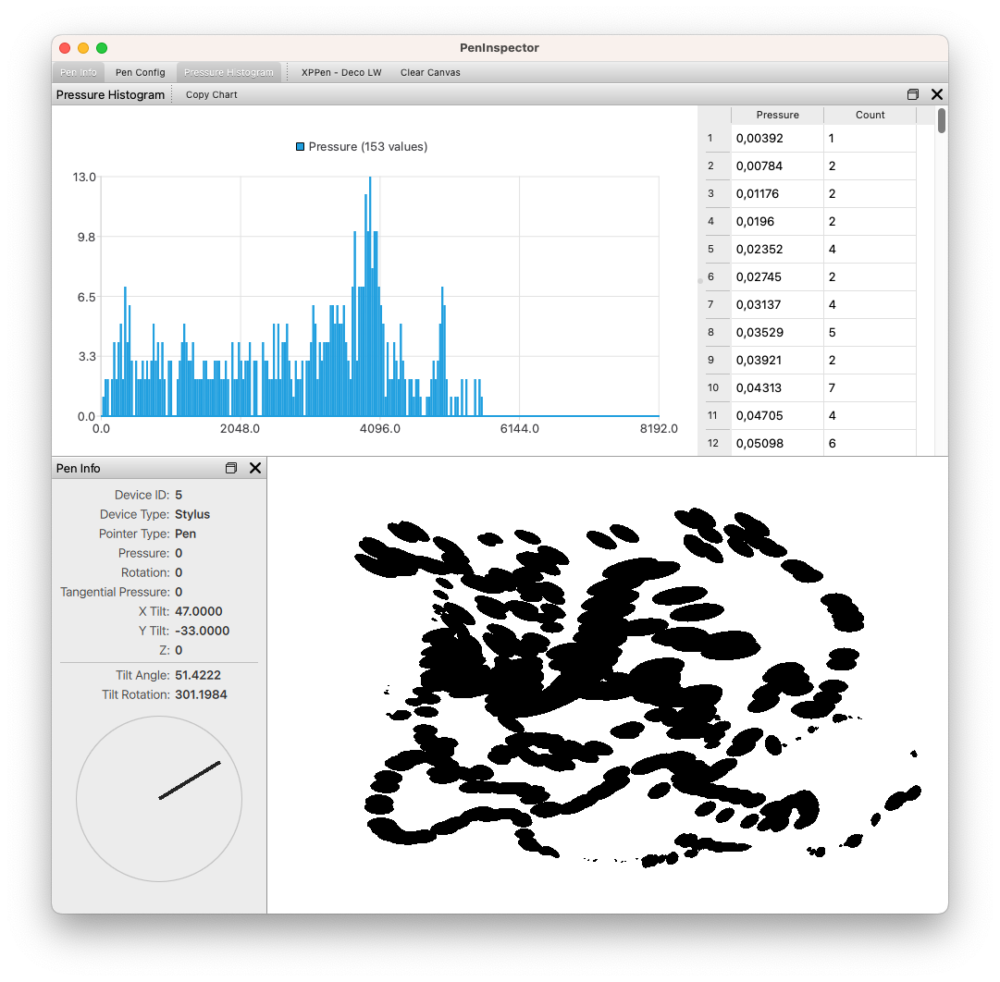
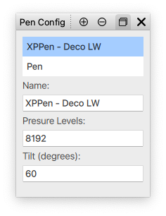

# PenInspector

Simple Qt application to inspect data provided by graphics tablet styluses.

## Usage

* configure your stylus using the **Pen Config** dock
* select one of your styluses as the active one in the top application toolbar
* draw something with your stylus in the canvas area
* the **Pressure Histogram** dock will show a histogram with the pressure values reported by the stylus
* copy the chart image to clipboard using **Copy Chart** button from the *Pressure Histogram* dock toolbar

### Pen Config

* set a name so that you can identify your pen in the top toolbar
* the *pressure levels* is used by the **Pressure Histogram** to determine possible bucket values (stylus pressure is reported by Qt as a real number between 0.0 and 1.0)
* use **Append** to append a new empty config to the end of the config list
* use **Remove** to remove the **selected** configuration

