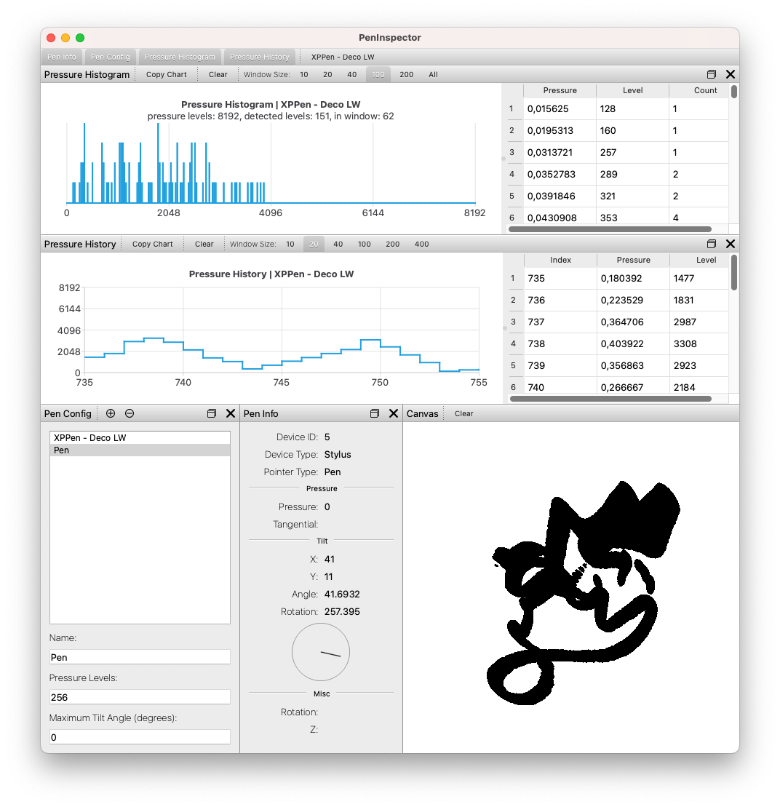
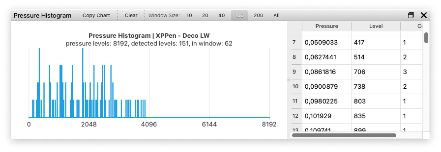

# PenInspector

Simple Qt application to inspect data provided by graphics tablet styluses.

Tested on macOS, but it should work on Windows and Linux, too.

## Usage

* configure your stylus using the **Pen Config** dock
* select one of your styluses as the active one in the top application toolbar
* draw something with your stylus in the canvas area
* the **Pressure Histogram** dock will show a histogram with the pressure values reported by the stylus
* copy the chart image to clipboard using **Copy Chart** button from the *Pressure Histogram* dock toolbar

### Pen Config Dock

* set a name so that you can identify your pen in the top toolbar
* the *pressure levels* is used by the **Pressure Histogram** to determine possible bucket values (stylus pressure is reported by Qt as a real number between 0.0 and 1.0)
* use **Append** to append a new empty config to the end of the config list
* use **Remove** to remove the **selected** configuration
* when the app starts with no configured pen, a default pen (XPPen Deco LW) is created by the app
* this configuration can be changed or deleted, but if there are no other configured pens when the app closes, it will be recreated on restart

### Pen Info Dock

* displays data reported by Qt from the stylus
* only the top values are actually reported by Qt (from the top till the separator)
* *tilt angle* and *tilt rotation* values are computed by the application

### Pressure Histogram Dock

* shows a histogram (left) and a table with pressure data (right)
* the pressure data table contains the actual pressure value reported by Qt (in the *Pressure* column) and how many times it was reported (in the *Count* column)
* use the separator between the histogram and the table to set their widths
* use the **Copy Chart** button to copy the chart to clipboard

