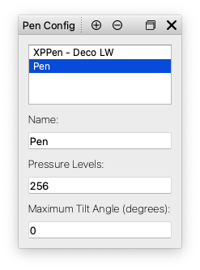

# PenInspector

Simple Qt application to inspect data provided by graphics tablet styluses.


## Detected Levels

| Tablet | Declared | Windows 10 (Ink) | macOS |
|---|---|---|---|
| XPPen Deco LW | 8192 | ~1024 | ~256 |

## Installation

### bypass notarize

The `.dmg` installer is not notarized. To be able to install and use `PenInspector.app` from it, you will need to bypass manually the Gatekeeper. Assuming that you've downloaded the `.dmg` in `~/Downloads`, you can bypass the Gatekeeper by running the command bellow in a **Terminal** window before mounting (double-clicking) the `.dmg`:

```sh
xattr -d com.apple.quarantine ~/Downloads/PenInspector-Installer.dmg
```

References:

* [How to bypass notarize ](http://www.pa-software.com/documentation/Bypass_Notarize/)

## Usage

* configure your stylus using the **Pen Config** dock
* select one of your styluses as the active one in the top application toolbar
* draw something with your stylus in the canvas area
* the **Pressure Histogram** dock will show a histogram with the pressure
* the **Pressure History** dock will show the actual pressure level as you draw in the canvas area
* copy the chart images to clipboard using **Copy Chart** buttons from the *Pressure Histogram* or *Pressure History* docks' toolbars

### Canvas Area

* pen data is received only while inside this area
* use **Clear** button to clear the canvas area

### Pen Config Dock

* set a **Name** so that you can identify your pen in the top toolbar
* the **Pressure Levels** is used by the **Pressure Histogram** to determine possible bucket values (stylus pressure is reported by Qt as a real number between 0.0 and 1.0)
* use the **Plus** button to add a new config to the end of the config list
* use the **Minus** button to remove the **selected** configuration
* when the app starts the first time or finds no configured pen on start, a default pen (XPPen Deco LW) will be created
* for now, the **Maximum Tilt Angle** is used by the **Pen InfoDock** to display the tilt



### Pen Info Dock

* displays data reported by operating system from the stylus
* *tilt angle* and *tilt rotation* values are computed by the application


### Pressure Histogram Dock

* shows a histogram (left) and a table with pressure data (right)
* the pressure data table contains:
  * Pressure: the actual pressure value reported by the operating system
  * Level: the level, based on the total number of pressure configured for the current pen
  * Count: how many times this pressure/level was reported
* use the separator between the histogram and the table to set their widths
* use the **Copy Chart** button to copy the chart to clipboard
* use the **Clear** button to clear the chart
* set a **Window Size** to limit the histogram to the a specific data set
  * **All** will use all pressure data to compute the histogram


### Pressure History Dock

* shows a graph with pressure (left) and a table with pressure data (right)
* every time the operating system reports a new pen event, the pressure value is added at the end (right side) of this graph
* the pressure data table contains:
  * Index: the index of the pressure value
  * Pressure: the actual pressure value reported by the operating system
  * Level: the level, based on the total number of pressure configured for the current pen
* use the separator between the histogram and the table to set their widths
* use the **Copy Chart** button to copy the chart to clipboard
* use the **Clear** button to clear the chart
* set a **Window Size** to limit the history to the a specific data set


Copyright (C) 2022 by Ioan Calin Borcoman
